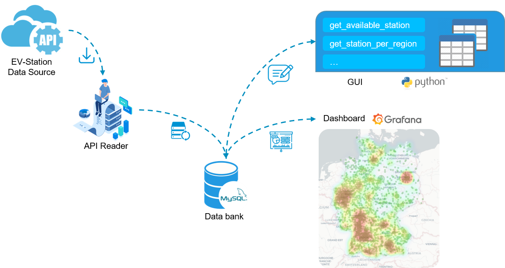

# EV_Station_Loader
A small tool to load and visualize electrical vehicle (EV) charging station information in germany

```
©À©¤©¤ README.md
©À©¤©¤ _Parser.py                    parse API data (data source deprecated)
©À©¤©¤ Load_API.py                   API data parser
©À©¤©¤ sql_server.py                 sql processing functions
©¸©¤©¤ Use_Case.py                   User Interface
```

## Achitecture



## Use Case
**Requirements<br>**
SQL service, Grafana

**Implemented Functions<br>**
    
```bash
$ python ./Use_Case.py
# function =    "0. get the number of available EV stations.\n" \
#               "1. get EV stations info. per city.\n" \
#               "2. get EV stations info. per state.\n" \
#               "3. get average utilization of EV stations per city in specified time.\n" \
#               "4. get average utilization of EV stations per state in specified time.\n" \
#               "5. exit.\n"\

# after the commands 1-4, the results will saved in local SQL databank, can be visualized with Grafana
```

